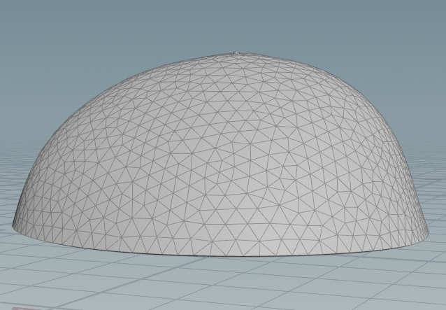
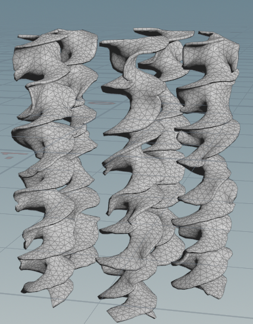
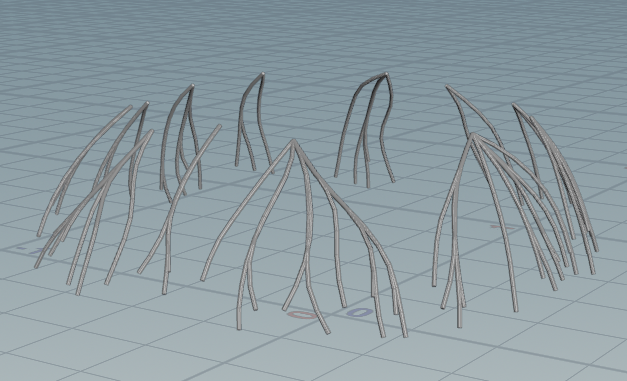
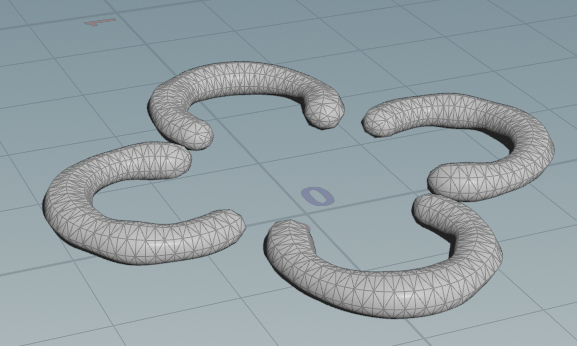
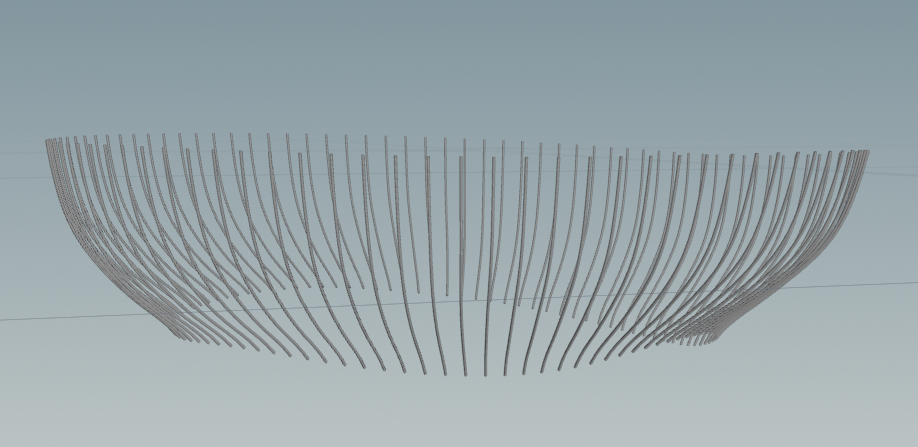

# Procedural Jellyfish

## Components

### Bell

For the bell, I used a line with two bends on either end. I then rotated this around the Y axis
and remeshed it to help even out triangle sizes as well as prepare for the veins step later on.
I created a controller node to write keyframes for a few of these bend and translate parameters to
animate my bell.

### Arms

For the arms I mainly followed the guide for this project, making a plane with some deformation,
pinning the top points to follow the jellyfish's centroid, then simulating as a vellum cloth.

### Veins

For the veins, I took the bell before being poly extruded at frame 1, and grabbed two groups of points,
one for the start of the veins and another for the end. I used the bell before extrusion to ensure I only got points on the outside of the bell. I then used a shortest paths node along with smoothing and sweep nodes to make the veins more smooth and give them thickness. I also used a point deform to restore the animated morphs of the bell and apply them to the veins as well.

### Organs

For the organs I took the approach of starting from a line. I bent the line and used a sweep node with a custom ramp to give the organs some bumpyness. I then copied these in a similar manner to the arms, creating 4 of them in a circle, 90 degrees from one another. Lastly I used a transform node so they would bob up and down with the bell of the jellyfish.

### Tentacles

For the tentacles I first grabbed a group of points at the base of the bell at frame 1, then point deformed them. I used a line as my base, and a copy to points node to duplicate the tentacle to each of the base points of the bell I selected. I used a group expression to isolate the start points of the tentacles, then put them into a vellum hair simulation, with the start points being the pinned points. Finally I did sweep the lines to give the tentacles a bit of thickness.

## Animation

https://github.com/user-attachments/assets/52b1d5f6-d48e-417b-974d-38d11694e0b3

